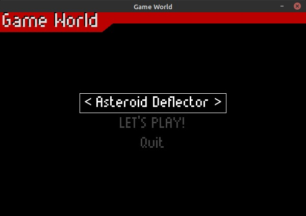
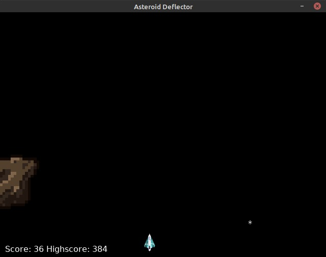
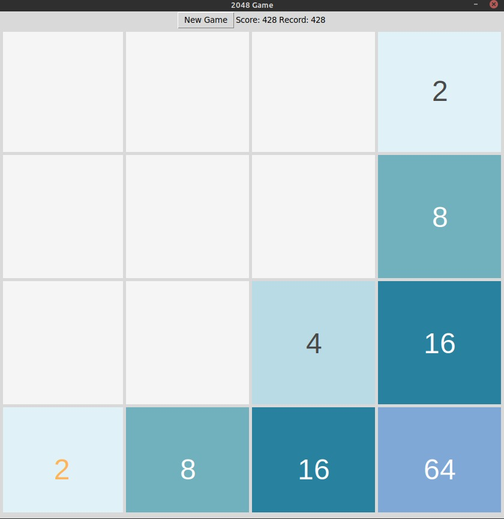
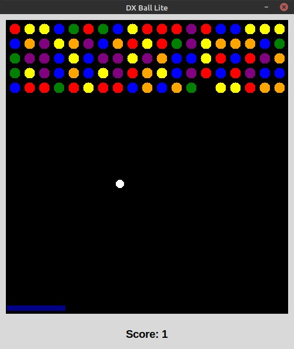
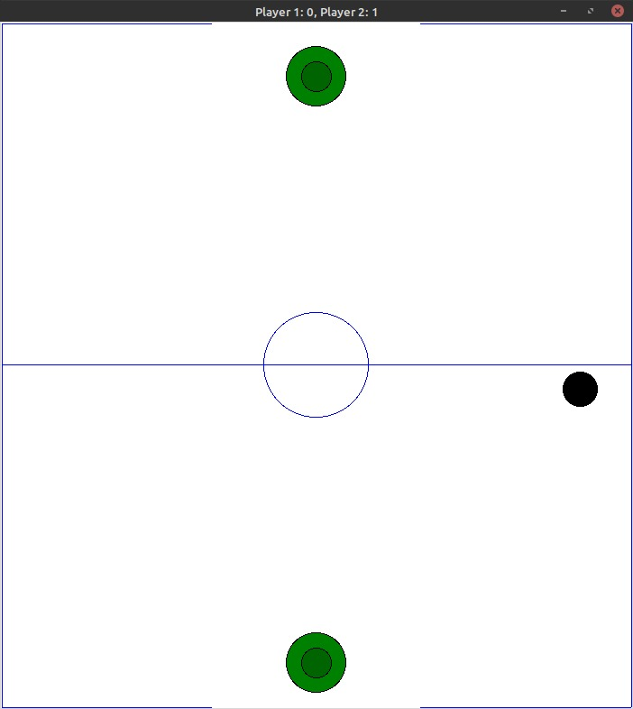

This repository hosts the submission of team `hava` for the [PyWeek](#htttps://thepythonweek.tech) 48 hour Hackathon. It was conducted between 8/1/2021 to 10/1/2021.

Our submission entry is a `Game World` consisting of 4 games, namely:

1. Asteroid Deflector

   

2. 2048 game

   

3. DX Ball Lite

   

4. Air Hockey

   

It was designed using Python elements pygame, pygame-menu, Tkinter and Pyglet

Link to video demonstration explaining the working:

`hava` team members are:

1. **H**arshit Singh
2. **A**shok Arora
3. **V**ishnu Agarwal
4. **A**niket Sharma
